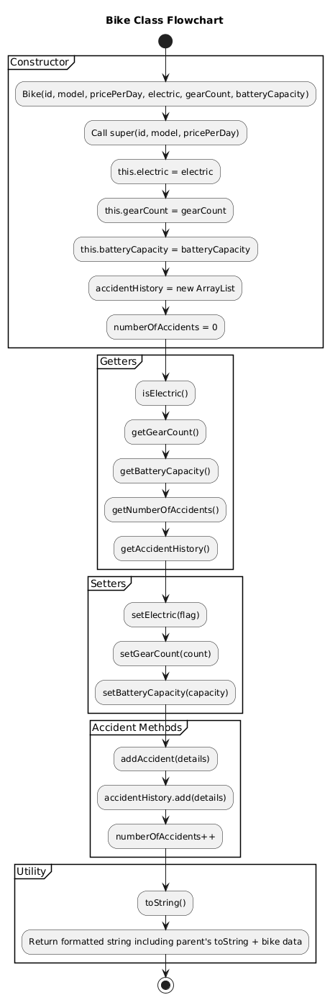
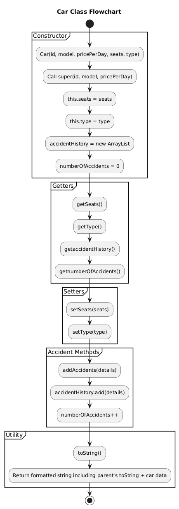
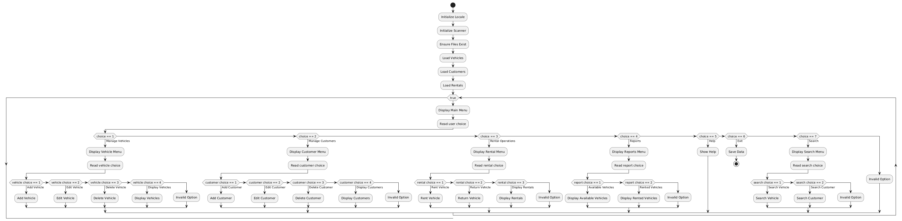

# Vehicle Rental Management System  

**Authors:** Abdullah Syed (F2400163) • Yousif Mahfoudhi (F2400002) • Kishan Biju (F2400101)

## 📌 Introduction  

A comprehensive Java-based Vehicle Rental Management System designed to streamline vehicle inventory, customer records, and rental transactions. Core features include complete CRUD operations for vehicles and customers, transaction processing, analytics reporting, and persistent data storage with full Arabic language support. Implements fundamental OOP principles (Encapsulation, Inheritance, Polymorphism, Abstraction) alongside efficient data structures (ArrayList, HashMap, Queue).

---

## 👥 Team Plan

- **Week 1:** Requirements analysis, architecture design, UML modeling, workflow specification
- **Week 2:** Core implementation, file I/O integration, menu system development  
- **Week 3:** Quality assurance, debugging, documentation finalization

---

## 📋 Project Requirements

**Objective:** Comprehensive vehicle and customer management platform for rental businesses featuring advanced search, real-time tracking, and analytics capabilities.

**Key Operations:**

- **Vehicles:** Create, update, delete, display inventory, search by ID, filter by availability status
- **Customers:** Manage customer profiles, update records, search customer database
- **Rentals:** Process vehicle checkout/return, monitor active rentals, review transaction history
- **Reports:** Generate business intelligence reports with interactive help system

---

## 🚗 UML Class Diagram

```mermaid
classDiagram
    Vehicle <|-- Car
    Vehicle <|-- Bike
    Customer --> Vehicle : rentedVehicle
    
    class Vehicle {
        -int id
        -String model
        -double pricePerDay
        -boolean available
        -Queue~String~ serviceDates
        +Vehicle(int, String, double)
        +getId() int
        +setId(int) void
        +getModel() String
        +setModel(String) void
        +getPricePerDay() double
        +setPricePerDay(double) void
        +isAvailable() boolean
        +setAvailable(boolean) void
        +getServiceDates() Queue~String~
        +markAsRented() void
        +markAsReturned() void
        +addServiceDate(String) void
        +completeNextService() String
        +getNextServiceDate() String
        +toString() String
    }
    
    class Car {
        -int seats
        -String type
        -ArrayList~String~ accidentHistory
        -int numberOfAccidents
        +Car(int, String, double, int, String)
        +getSeats() int
        +setSeats(int) void
        +getType() String
        +setType(String) void
        +getAccidentHistory() ArrayList~String~
        +getNumberOfAccidents() int
        +addAccidents(String) void
        +toString() String
    }
    
    class Bike {
        -boolean electric
        -int gearCount
        -double batteryCapacity
        -ArrayList~String~ accidentHistory
        -int numberOfAccidents
        +Bike(int, String, double, boolean, int, double)
        +isElectric() boolean
        +setElectric(boolean) void
        +getGearCount() int
        +setGearCount(int) void
        +getBatteryCapacity() double
        +setBatteryCapacity(double) void
        +getNumberOfAccidents() int
        +getAccidentHistory() ArrayList~String~
        +addAccident(String) void
        +toString() String
    }
    
    class Customer {
        -int id
        -String name
        -String phone
        -Vehicle rentedVehicle
        +Customer(int, String, String, Vehicle)
        +getId() int
        +getName() String
        +setName(String) void
        +getPhone() String
        +setPhone(String) void
        +getRentedVehicle() Vehicle
        +getCurrentVehicle() Vehicle
        +setRentedVehicle(Vehicle) void
        +toString() String
    }
    
    class Main {
        -String VEHICLES_FILE
        -String CUSTOMERS_FILE
        -String RENTALS_FILE
        -List~Vehicle~ vehicles
        -List~Customer~ customers
        -List~String~ rentals
        -Map~Integer,Vehicle~ vehicleMap
        -Map~Integer,Customer~ customerMap
        +main(String[]) void
        +manageVehicles(Scanner) void
        +addVehicle(Scanner) void
        +editVehicle(Scanner) void
        +deleteVehicle(Scanner) void
        +displayVehicles() void
        +manageCustomers(Scanner) void
        +addCustomer(Scanner) void
        +editCustomer(Scanner) void
        +deleteCustomer(Scanner) void
        +displayCustomers() void
        +rentalOperations(Scanner) void
        +rentVehicle(Scanner) void
        +returnVehicle(Scanner) void
        +displayRentals() void
        +generateReports(Scanner) void
        +displayAvailableVehicles() void
        +displayRentedVehicles() void
        +showHelp() void
        +ensureFilesExist() void
        +loadVehicles() void
        +loadCustomers() void
        +loadRentals() void
        +saveData() void
        +saveRentals() void
        +searchData(Scanner) void
        +searchVehicle(Scanner) void
        +searchCustomer(Scanner) void
    }
    
    Main --> Vehicle : manages
    Main --> Customer : manages
```

---

## 🏗️ System Architecture

**Class Hierarchy:**

- **Vehicle** (Abstract Base) → **Car** & **Bike** (Concrete Implementations)
- **Customer** - Encapsulates customer information and rental associations
- **Main** - Application controller orchestrating UI, business logic, and data persistence

**Data Structures:** ArrayList (collections), HashMap (fast lookups), Queue (service scheduling)  
**Persistence Layer:** Text-based storage with UTF-8 encoding for multilingual support

---

## 📊 Flowchart

---

## 🔧 Implementation

Employs object-oriented architecture leveraging inheritance (Vehicle → Car/Bike), encapsulation, and polymorphism. The Main controller orchestrates menu-driven operations, data persistence, and implements HashMap-based indexing for O(1) lookup performance. Features bilingual interface (English/Arabic) for enhanced accessibility.

---

## 🧪 Testing

---

## 🎯 Conclusion

Successfully demonstrates advanced OOP principles through a production-ready vehicle/customer management solution featuring transaction processing, analytics generation, and robust data persistence. Leverages core design patterns including inheritance, polymorphism, and efficient data structures (ArrayList, Queue, HashMap) within an intuitive console interface. Architected for extensibility with clear pathways for enhancements: payment gateway integration, GUI development, and database migration.
